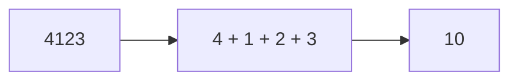

# Problema
Dado un número `n`, calcular la suma de sus dígitos **sin** usar una `string` intermediaria.

# Ejemplo

```mermaid
flowchart LR
    num[4123]
    sum[4 + 1 + 2 + 3]
    total[10]

    num --> sum
    sum --> total
```
